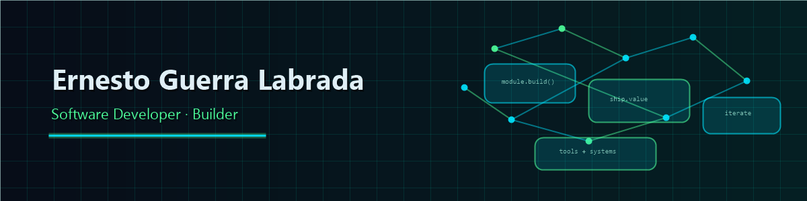

<!-- ╔═══════════════════════════════════════════════════════════════════════════╗
     ║  HEADER: TYPING SVG + BANNER                                            ║
     ╚═══════════════════════════════════════════════════════════════════════════╝ -->

    
     
  

---

<!-- ╔═══════════════════════════════════════════════════════════════════════════╗
     ║  ABOUT ME                                                               ║
     ╚═══════════════════════════════════════════════════════════════════════════╝ -->

## 👨‍💻 About Me

- 🤓 **Software Developer** — `Ernesto Guerra Labrada`
- 💬 Reach me at: **`ernesg93@gmail.com`**
- 🌱 **Building useful software and learning every day**
- ⚡ Passionate about building tools that improve people's lives
- 🤝 Always open to collaboration and new opportunities

## 🌎 Find Me

  
  
  

<!-- ╔═══════════════════════════════════════════════════════════════════════════╗
     ║  TECHNOLOGIES & TOOLS — 3-COLUMN TABLE                                  ║
     ╚═══════════════════════════════════════════════════════════════════════════╝ -->

## 🚀 Technologies & Tools

  <table>
    <tr>
      <th>Frontend</th>
      <th>Backend</th>
      <th>DevOps</th>
    </tr>
    <tr>
      <td>
        

          
          
          
          
          
          
          
          
          
          
          
          
        

      </td>
      <td>
        

          
          
          
          
          
          
          
          
          
          
          
          
        

      </td>
      <td>
        

          
          
          
          
          
          
          
          
        

      </td>
    </tr>
  </table>

<!-- ╔═══════════════════════════════════════════════════════════════════════════╗
     ║  GITHUB STATISTICS                                                       ║
     ╚═══════════════════════════════════════════════════════════════════════════╝ -->

## 📊 GitHub Statistics

  <table border="none" align="center">
    <tr>
      <td align="center" style="padding: 10px;">
        
      </td>
      <td align="center" style="padding: 10px;">
        
      </td>
    </tr>
    <tr>
      <td colspan="2" align="center" style="padding: 10px;">
        
      </td>
    </tr>
    <tr>
      <td colspan="2" align="center" style="padding: 10px;">
        
      </td>
    </tr>
  </table>

## 🏆 Achievements & Trophies

  

<!-- ╔═══════════════════════════════════════════════════════════════════════════╗
     ║  ACTIVITY FEED — AUTO-POPULATED BY WORKFLOW                              ║
     ╚═══════════════════════════════════════════════════════════════════════════╝ -->

## ⚡ Recent Activity

<!--START_SECTION:activity-->

<!-- Recent GitHub activity will appear here after the first workflow run -->

<!--END_SECTION:activity-->

## 💡 Featured Projects

> Coming soon — selected projects will be added here.

## 🛠️ Developer Tools

> Coming soon — developer tools and utilities will be added here.

<!-- ╔═══════════════════════════════════════════════════════════════════════════╗
     ║  PROFILE VIEWS + SNAKE + FOOTER                                         ║
     ╚═══════════════════════════════════════════════════════════════════════════╝ -->

## 📈 Profile Views

  

 

<!-- ╔═══════════════════════════════════════════════════════════════════════════╗
     ║  FOOTER — WAVE CAPSULE + ATTRIBUTION                                    ║
     ╚═══════════════════════════════════════════════════════════════════════════╝ -->

     

<!--
  ATTRIBUTION: This template is based on EduardoProfe666's GitHub profile.
  Please keep this line to acknowledge the original source. If you significantly
  modify the template, you may change "Based on" to "Inspired by" or remove
  this attribution, though keeping it is appreciated.
-->

  <i>Based on <a href="https://github.com/EduardoProfe666">EduardoProfe666</a>'s profile</i>

